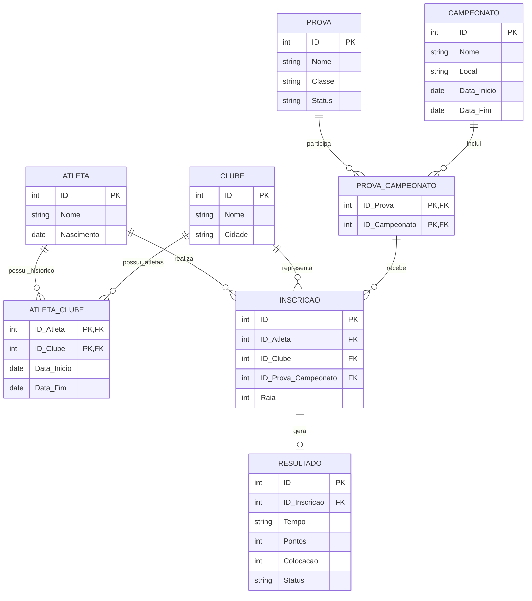

# Modelagem e Estatísticas - Troféu Alexandre Pussieldi
## Diagrama MERMAID

```mermaid
erDiagram
    ATLETA {
        int ID PK
        string Nome
        date Nascimento
    }

    CLUBE {
        int ID PK
        string Nome
        string Cidade
    }

    ATLETA_CLUBE {
        int ID_Atleta PK, FK
        int ID_Clube PK, FK
        date Data_Inicio
        date Data_Fim
    }

    CAMPEONATO {
        int ID PK
        string Nome
        string Local
        date Data_Inicio
        date Data_Fim
    }

    PROVA {
        int ID PK
        string Nome
        string Classe
        string Status
    }

    PROVA_CAMPEONATO {
        int ID_Prova PK, FK
        int ID_Campeonato PK, FK
    }

    INSCRICAO {
        int ID PK
        int ID_Atleta FK
        int ID_Clube FK
        int ID_Prova_Campeonato FK
        int Raia
    }

    RESULTADO {
        int ID PK
        int ID_Inscricao FK
        string Tempo
        int Pontos
        int Colocacao
        string Status
    }

    ATLETA ||--o{ ATLETA_CLUBE : possui_historico
    CLUBE ||--o{ ATLETA_CLUBE : possui_atletas

    PROVA ||--o{ PROVA_CAMPEONATO : participa
    CAMPEONATO ||--o{ PROVA_CAMPEONATO : inclui

    ATLETA ||--o{ INSCRICAO : realiza
    CLUBE ||--o{ INSCRICAO : representa
    PROVA_CAMPEONATO ||--o{ INSCRICAO : recebe

    INSCRICAO ||--o| RESULTADO : gera
```
